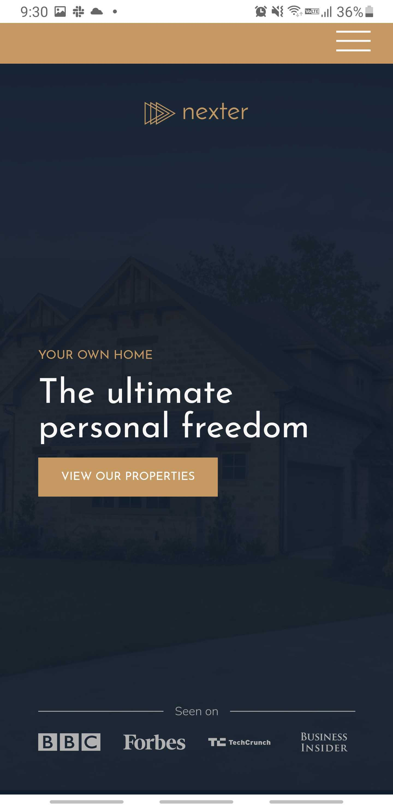

  

---

#### Nexter is a fake real estate website! You can see our best housing selections and our top realtors ranking. You are looking for a house ? don't wait any longer!

---

## Table of contents

- [General info](#general-info)
- [Screenshots](#screenshots)
- [Technologies](#technologies)
- [Contact](#contact)

## General info

Project created during an advanced CSS course with the goal of teaching advanced styling method such as Sass, FlexBox, CSSGrid and best practice, Page being fully responsive as well.
I hope you will have as much fun looking at it as I had fun building it.

## Screenshots

  
  &nbsp; &nbsp;
  
  &nbsp; &nbsp;
  

## Technologies

## Contact

